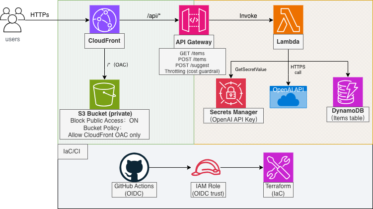

# FridgeOps（FridgeBox）

冷蔵庫の食材を管理する、シンプルなメモアプリ（兼ポートフォリオ）。  
アプリ側は最低限。主に AWS 側（設計 / IaC / 運用 / セキュリティ / コスト）を整理して、説明できる形にするための箱。



- static: CloudFront →（OAC）→ S3（private）
- api: CloudFront（/api/*）→ API Gateway（HTTP API / apigatewayv2）→ Lambda → DynamoDB
- frontend から同一ドメインで API を呼ぶ（CORS の分断を避ける）
- S3 は private のまま。CloudFront 経由以外は通さない（S3 direct access は 403）
- 注: 図には v2 の要素（/suggest, Secrets など）も含む。v1 は items の E2E を最優先。

---

## Demo（current dev / v1）

- CloudFront: https://d3cjucnmtwwxvv.cloudfront.net
- API:
  - GET  https://d3cjucnmtwwxvv.cloudfront.net/api/items
  - POST https://d3cjucnmtwwxvv.cloudfront.net/api/items

注: 値は apply ごとに変わる。都度 `terraform -chdir=infra/main output -raw cloudfront_domain_name` の結果で更新する。

---

## v1 / v2（方針）

このプロジェクトは 2 段階で進める。

- v1: 検収できる E2E を仕上げる（apply → verify → destroy）
- v2: v1 が固まってから “公開耐性/実用性” を積む（AI / cache / risk & cost control）

v1--->完成
v2--->更新中

---

## v1（current）

### できること
- list: 登録済みの食材を一覧で返す
- add: 食材を 1 件追加する

### v1 の安全・運用
- OAC only：S3 は private のまま、CloudFront 経由以外は通さない（S3 direct 403）
- OIDC：GitHub Actions は long-lived AWS key を持たない（planまで回す）
- CloudWatch：Logs + Alarm 最小1つ
- destroy：apply → verify → destroy を前提に、主要リソースを残さない

### 検収できる状態（DoD）
- CloudFront で静的ページが表示できる
- S3 direct access は 403（CloudFront 経由のみ）
- GitHub Actions（OIDC）で Terraform plan が通る（AWS key なし）
- API（GET/POST /api/items）が curl で動く
- CloudWatch Logs が見える + Alarm 最小 1 個
- destroy 後に主要リソースの残骸がない（apply → verify → destroy が成立）

---

## Repo

- infra/bootstrap/ : remote state + lock（初回だけ）
- infra/main/      : 本体インフラ（CloudFront/S3/HTTP API/Lambda/DDB/IAM/CloudWatch）
- docs/            : 設計メモ・判断理由・運用メモ（必要なものだけ増やす）
- assets/          : 図/補助メモ

---

## ローカル手順（最短）

```bash
# 1) bootstrap（初回だけ）
terraform -chdir=infra/bootstrap init
terraform -chdir=infra/bootstrap apply

# 2) main
terraform -chdir=infra/main init
terraform -chdir=infra/main apply

# 3) 出力を確認（README の Demo 更新に使う）
terraform -chdir=infra/main output -raw cloudfront_domain_name

# destroy（逆順：main → bootstrap）
terraform -chdir=infra/main destroy
terraform -chdir=infra/bootstrap destroy
CI（GitHub Actions）

OIDC で plan を回す（long-lived AWS key は使わない）

最低限：fmt / validate / plan

v2（later / TODO）

v1 が固まってから “公開耐性/実用性” を積む。

/suggest（AI）

cache / 正規化（alias 等）

risk & cost control（WAF / throttling / budgets / alarms / concurrency / feature flags など）

secret は runtime read（Secrets Manager or SSM）。repo/CI/frontend に置かない

（このセクションは v2 着手時に更新）
